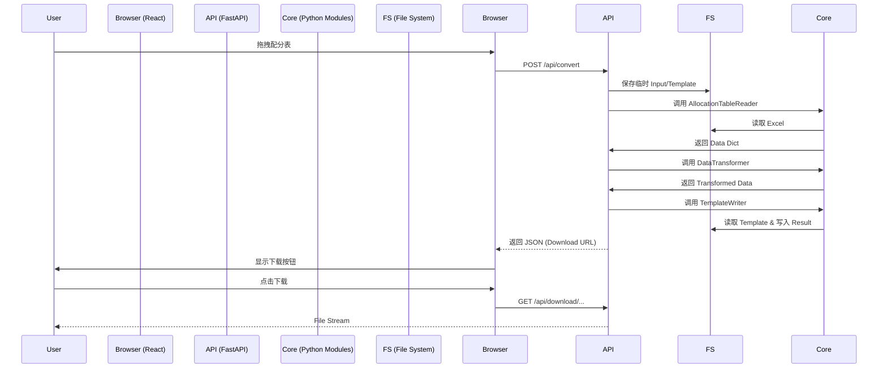

# AutoPackage V2 产品需求文档 (PRD)

## 1. 项目概述

### 1.1 核心目标 (Mission)
让繁琐的物流配分数据处理变得像“拖拽文件”一样简单、直观且零差错。将现有的本地 Python 脚本工具升级为具备现代化 Web 交互体验的智能工具。

### 1.2 用户画像 (Persona)
- **主要用户**：物流/行政专员 (Logistics Coordinator)
- **核心痛点**：
  - 恐惧出错：手动处理 Excel 容易看花眼。
  - 操作繁琐：每天重复打开软件、选择文件。
  - 过程黑盒：点击运行后不知道进度，只能等结果。

## 2. 产品路线图 (Roadmap)

### 2.1 V1: MVP (最小可行产品) - 本次迭代目标
- **Smart File Hub**：拖拽上传 Excel 配分表，自动解析。
- **Live Console**：Web 界面实时显示处理日志（解析中 -> 转换中 -> 写入中）。
- **模板热切换**：支持上传自定义 `template.xls`。
- **结果即时下载**：处理完成后直接下载结果文件。
- **技术架构**：基于 Python FastAPI + React (Single File) + Tailwind/Shadcn UI。

### 2.2 V2: Future (未来规划)
- **历史记录数据库**：记录每次转换的输入输出，支持追溯。
- **规则可视化编辑器**：在网页上拖拽修改 `AllocationTableConfig`。
- **多用户/云端部署**：支持账号体系与权限管理。

## 3. 功能需求 (Functional Requirements)

### 3.1 前端交互 (Web UI)
1.  **文件上传区**：
    - 支持拖拽 (`Drag & Drop`) 和点击上传。
    - 仅接受 `.xls`, `.xlsx` 格式。
    - 显示当前选中文件名。
2.  **操作控制台**：
    - "开始转换" 按钮：触发转换流程。
    - 状态指示器：Idle / Uploading / Processing / Success / Error。
3.  **实时日志 (Log Viewer)**：
    - 滚动显示后端处理进度（如："读取数据中...", "正在写入模板..."）。
    - 错误信息高亮显示。
4.  **结果卡片**：
    - 转换成功后显示。
    - 提供 "下载文件" 按钮。
    - 提供 "处理下一个" 按钮以重置状态。

### 3.2 后端逻辑 (API)
1.  **文件接收**：`POST /api/convert`
    - 接收 `file` (配分表) 和可选的 `template` (模板)。
    - 临时存储文件以供处理。
2.  **核心转换调用**：
    - 复用 `excel_reader.py` 读取数据。
    - 复用 `data_transformer.py` 转换结构。
    - 复用 `template_writer.py` 生成结果。
3.  **结果交付**：`GET /api/download/{filename}`
    - 提供生成文件的下载流。
4.  **自动清理**：
    - 定期或在处理完成后清理临时上传的文件。

## 4. 数据契约 (Data Contract)

### 4.1 核心业务规则
- **文件名解析**：优先提取文件名中 `()` 或 `（）` 内的数字作为 ID；若无，使用时间戳。
- **数据校验**：严格校验上传 Excel 的表头结构是否符合 `config.py` 定义。
- **模板填充**：保留模板原有样式（字体、边框），仅填充数据值。

### 4.2 API 接口定义

**POST /api/convert**
- **Request**: `multipart/form-data`
  - `file`: Binary (Excel)
  - `template`: Binary (Excel, Optional)
- **Response**: JSON
  ```json
  {
    "status": "success",
    "message": "Conversion successful",
    "download_url": "/api/download/【箱設定 上海】12345 振分.xlsx",
    "stats": {
      "items_processed": 150,
      "generated_file": "【箱設定 上海】12345 振分.xlsx"
    }
  }
  ```

## 5. 架构设计 (Architecture)

### 5.1 技术栈
- **Frontend**: HTML5 + React (CDN) + Tailwind CSS (CDN) + Lucide Icons。
- **Backend**: Python 3.10+ + FastAPI + Uvicorn。
- **Core Logic**: Existing Python Modules (`excel_reader`, `data_transformer`, `template_writer`).

### 5.2 目录结构
```text
AutoPackage/
  ├── web_server/
  │    ├── main.py        # FastAPI App
  │    ├── requirements.txt
  │    └── static/
  │         └── index.html # React Single Page App
  ├── start_web.bat       # Launcher
  ├── ... (Existing Logic Files)
```

### 5.3 核心流程 (Sequence)

