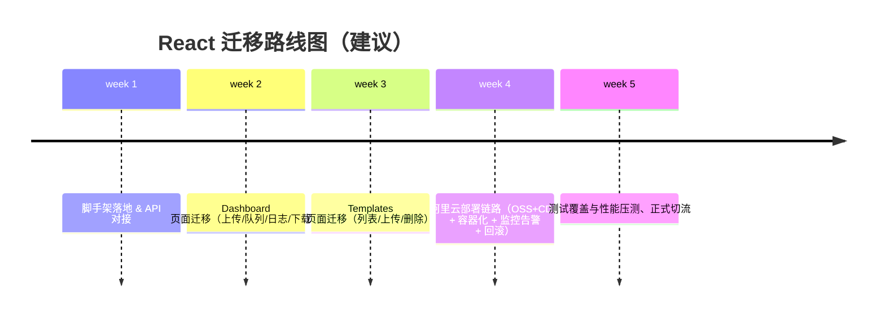

# AutoPackage React 技术栈迁移方案（阿里云部署）

## 0. 结论概览

本项目当前形态是“Python 核心处理逻辑 + FastAPI Web 服务 + 单文件 React（浏览器端 Babel 编译）”，适合本地/内网快速交付，但不适合长期迭代与阿里云生产部署。迁移目标建议为“React（Vite 构建）前后端分离 + 资产上 OSS/CDN + FastAPI 容器化部署 + 可观测与回滚闭环”。

## 1. 架构评估阶段

### 1.1 目录结构与模块划分（现状）

项目根目录 `d:\AutoPackage` 主要包含：

- `AutoPackage/`：Python 核心逻辑与本地 GUI（Tkinter）入口
- `web_server/`：FastAPI Web 服务 + `static/index.html` 单文件 React 页面（Babel in-browser 编译）
- `templates/`：模板库（上传/删除由 Web API 管理）
- `temp_uploads/`、`temp_outputs/`：临时文件输入/输出目录
- `docs/prd_v2.md`：V2 PRD（已明确 FastAPI + React + Tailwind 的方向）

### 1.2 现有技术栈组成与版本信息（现状）

**前端（`web_server/static/index.html`）**

- React：`18.3.1`（`web_server/static/vendor/react.development.js`）
- ReactDOM：`18.3.1`（`web_server/static/vendor/react-dom.development.js`）
- Babel（浏览器端 JSX 编译）：`web_server/static/vendor/babel.min.js`
- Tailwind（运行时注入版）：`web_server/static/vendor/tailwindcss.js`（版本未在文件头部直接暴露）
- 图标：Lucide（`web_server/static/vendor/lucide.min.js`）
- 批量打包下载：JSZip（`web_server/static/vendor/jszip.min.js`）

**后端（`web_server/main.py`）**

- FastAPI：`>=0.68.0`（`web_server/requirements.txt`）
- Uvicorn：`>=0.15.0`
- `python-multipart`：`>=0.0.5`（处理 `multipart/form-data` 上传）
- `aiofiles`：`>=0.7.0`
- CORS：全放开（`allow_origins=["*"]`）

**核心处理（`AutoPackage/*.py`）**

- `xlrd==2.0.1`（`AutoPackage/requirements.txt`）
- `openpyxl==3.1.2`（`AutoPackage/requirements.txt`）
- `pandas`：在 `AutoPackage/excel_reader.py` 中被强依赖，但当前 `requirements.txt` 未声明
- `zstandard==0.23.0`：项目根 `requirements.txt`（当前目录用途需进一步确认）

**关键缺口（需在生产化前补齐）**

- `pandas` 未在任何 `requirements.txt` 里声明，Web 服务运行到明细表解析会直接缺依赖（`AutoPackage/excel_reader.py:10`）
- 后端依赖仅写了最低版本，缺少锁定版本与可复现构建策略
- 前端采用浏览器端 Babel 编译与 CDN/本地 vendor 方式，不具备工程化分层、类型检查、构建产物缓存、按需拆包等能力

### 1.3 当前模块依赖关系图（现状）

```mermaid
flowchart TD
  subgraph FE[web_server/static 单文件前端]
    IDX[index.html\nReact 18 + Babel + Tailwind]
  end

  subgraph API[web_server/main.py FastAPI]
    APP[FastAPI app]
    API_TPL[/api/templates\nlist/upload/delete/]
    API_CONV[/api/convert/]
    API_DL[/api/download/{filename}/]
  end

  subgraph CORE[AutoPackage 核心逻辑]
    RDR[excel_reader.py\nAllocationTableReader\nDetailTableReader]
    TRN[data_transformer.py\nDataTransformer]
    WRT[template_writer.py\nTemplateWriter]
    DN[delivery_note_generator.py\nDeliveryNoteGenerator]
    AS[assortment_generator.py\nAssortmentGenerator]
    SD[store_detail_writer.py\nStoreDetailWriter]
    CFG[config.py\n*Config 常量]
  end

  subgraph FS[文件系统]
    TPLS[templates/\n模板库]
    UP[temp_uploads/\n上传临时]
    OUT[temp_outputs/\n输出临时]
    VDR[web_server/static/vendor/\n前端第三方库]
  end

  IDX -->|fetch| API_CONV
  IDX -->|fetch| API_TPL
  IDX -->|GET| API_DL

  APP --> API_TPL
  APP --> API_CONV
  APP --> API_DL
  APP -->|StaticFiles| VDR

  API_CONV -->|调用| RDR
  API_CONV -->|调用| TRN
  API_CONV -->|调用| WRT
  API_CONV -->|按模式| DN
  API_CONV -->|按模式| AS
  API_CONV -->|可选| SD

  RDR --> CFG
  TRN --> CFG
  WRT --> CFG
  DN --> CFG
  AS --> CFG
  SD --> CFG

  API_TPL --> TPLS
  API_CONV --> UP
  API_CONV --> OUT
  API_DL --> OUT
```

### 1.4 与 React 工程化技术栈的兼容性差异分析

**当前前端方式（单文件 React + Babel in-browser）的问题**

- 性能：首次加载大、运行时编译 JSX，弱网/低配环境体验差
- 可维护性：一个 `index.html` 承载全部组件与逻辑，无法模块化协作
- 工程能力缺失：无 TypeScript、无 ESLint、无单测、无构建产物版本管理
- 生产部署不友好：难以做长缓存（`immutable`）、难以做灰度与回滚

**与目标 React 工程化的兼容点（可复用）**

- UI/交互流程基本清晰：上传、模板管理、批量处理、日志展示、打包下载
- API 形态简单稳定：`/api/convert`、`/api/templates`、`/api/download`
- 现有页面组件可按功能切块迁移为 `pages/` 与可复用 `components/`

## 2. 迁移规划阶段

### 2.1 目标架构（阿里云最佳实践优先）

**推荐目标形态：前后端分离**

- 前端：Vite 构建产物上传 OSS，走 CDN 加速（静态资源强缓存）
- 后端：FastAPI 容器化部署到 ECS/ACK，提供 API 与文件下载
- 统一入口：Nginx/ALB 负责反向代理 API；前端走 CDN 域名

```mermaid
flowchart LR
  U[用户浏览器] --> CDN[阿里云 CDN]
  CDN --> OSS[OSS\nReact 静态资源]
  U --> ALB[ALB/Nginx\napi.example.com]
  ALB --> API[FastAPI (Docker)\nECS/ACK]
  API --> SLS[日志: SLS]
  API --> OUTS[对象存储/本地盘\n输出文件]
```

**备选：单体部署（不优先）**

- FastAPI 容器内同时托管 React `dist/` 静态资源
- 优点：部署简单、同源无需额外跨域
- 缺点：静态资源无法充分利用 CDN 强缓存；扩容策略受限；回滚粒度更粗

### 2.2 基于 React 的脚手架架构方案（建议落地选型）

**构建工具：Vite + React + TypeScript**

- 开发启动快、生产构建成熟
- 支持代码分割、资源哈希、环境变量注入（对阿里云多环境友好）

**状态管理：Redux Toolkit**

- 适合把“批量任务队列 / 转换进度 / 模板库状态 / 全局通知”等整理成可预测状态
- 规模较小时也可逐步退回到 `Context API`（脚手架保留 Redux 能力）

**路由：React Router**

- `"/"`：转换工作台（Dashboard）
- `"/templates"`：模板管理

**组件库集成方案：Tailwind CSS +（可选）shadcn/ui**

- 短期：复刻现有 `Button/Card` 等基础组件，快速迁移
- 中期：引入 `shadcn/ui`（Radix + Tailwind）统一交互与可访问性

**API 数据层：Fetch + 统一 client**

- 统一 `baseURL`（支持 OSS/CDN 与 API 域名分离）
- 统一错误处理、超时、请求追踪 ID（便于 ARMS/SLS 排障）

### 2.3 原子化任务拆分清单（可直接排期）

#### UI 组件迁移计划

- 拆分 `index.html` 中组件为 `components/`：`Button`、`Card`、`FileList`
- 拆分页面为 `pages/`：`Dashboard`、`Templates`
- 抽离布局：`layout/SidebarLayout`

#### 业务逻辑重构方案

- 前端：把上传队列、逐个处理、日志与批量下载拆到 `features/convert/`
- 后端：把 `convert` 逻辑按 `mode` 拆成独立服务层函数（为并发与测试准备）

#### 数据层适配方案

- 前端：建立 `src/api/`，封装：
  - `convert(file, options)` -> `POST /api/convert`
  - `listTemplates()` / `uploadTemplate()` / `deleteTemplate()`
  - `download(url)`（支持 zip/单文件）
- 后端：规范响应结构与错误码；为大文件下载增加缓存头与范围请求策略（可选）

#### 第三方依赖处理方案

- 前端：JSZip 继续用于批量打包；Lucide 改为 npm 版 `lucide-react`
- 后端：补齐并锁定依赖（`pandas`、`openpyxl`、`xlrd`、`fastapi`、`uvicorn` 等）

## 3. 优化实施阶段

### 3.1 性能瓶颈识别与优化方向

**前端**

- 现状瓶颈：Babel in-browser 编译 + 单文件巨大 JS 负担
- 迁移收益：预编译、按需拆包、路由级分割、资源强缓存

**后端**

- 现状瓶颈：
  - Excel 解析/写入是 CPU+IO 重操作，单进程吞吐有限
  - 临时文件落盘与清理策略依赖本地磁盘
- 优化方向：
  - 使用多 worker（Uvicorn/Gunicorn）提升并发
  - 将大文件输出落 OSS（避免容器本地盘容量与生命周期问题）
  - 对转换任务引入队列（可选：Celery/RQ/阿里云 MNS + Worker）

### 3.2 代码规范与质量检查机制（建议）

**前端**

- ESLint + TypeScript 严格模式
- 统一格式化（Prettier）
- CI：PR 触发 `lint` + `typecheck` + `test`

**后端**

- Ruff（lint/format）+ MyPy（类型）+ Pytest（单测）
- 依赖锁定：`requirements.txt` 固定版本或 `poetry.lock`

### 3.3 渐进式迁移策略（平滑过渡）

建议采用“Strangler Fig”模式：

- 第 1 阶段：保持 `web_server/static/index.html` 可用，新增 React 工程仅用于本地并行开发
- 第 2 阶段：后端新增静态托管路径（或单独前端域名），灰度切流到新前端
- 第 3 阶段：新前端全面替换旧页面，保留旧页面一段时间作为回滚入口

## 4. 交付物

### 4.1 迁移计划书（本文件）

已包含：

- 技术决策说明
- 风险评估与应对
- 时间节点规划
- 阶段验收标准（见 5.3）

### 4.2 配套脚手架代码仓库（已在本项目中提供目录）

- `react_scaffold/`：Vite + React + TS + Router + Redux Toolkit + Tailwind 的可运行骨架

### 4.3 迁移实施路线图（Roadmap）



## 5. 质量保障措施（测试、审查、监控与回滚）

### 5.1 测试覆盖方案（建议）

- 前端：
  - 单测：Vitest（hooks/工具函数/Redux slice）
  - E2E：Playwright（上传、转换、下载、模板管理全链路）
- 后端：
  - Pytest：核心转换函数的关键路径（allocation/delivery_note/assortment）
  - 契约测试：固定输入样例对比输出文件关键单元格/元数据（抽样校验）

### 5.2 代码审查流程（建议）

- 所有变更走 PR
- 必须满足：`lint`、`typecheck`、`test` 通过
- 关键模块（Excel 解析/写入、输出命名、模板库管理）需要至少 1 名 reviewer

### 5.3 监控与回滚机制（阿里云）

- 监控：
  - SLS：应用日志收集、错误告警
  - ARMS：APM 链路追踪、接口耗时、错误率
  - Prometheus/Grafana（ACK 场景）：CPU/内存/worker 饱和
- 回滚：
  - 前端：OSS 版本化 + CDN 回源版本切换
  - 后端：镜像 tag 固定、蓝绿/金丝雀发布（ACK 或 ECS + Nginx）
- 数据安全：
  - 临时文件可落 OSS 并设置生命周期（自动清理）
  - 输出文件下载鉴权（后续引入：一次性 token / 签名 URL）

## 6. 风险评估与应对

| 风险 | 影响 | 应对 |
|---|---|---|
| 依赖不完整（`pandas` 未声明） | 线上直接运行失败 | 统一依赖清单并锁版本，构建时校验 |
| Excel 输入格式差异 | 转换失败或输出错误 | 样例集回归、契约测试、错误提示与日志增强 |
| Linux/容器环境文件名编码 | 下载/落盘异常 | 全链路 UTF-8，避免不安全路径拼接，S3/OSS key 统一规范 |
| 大文件与并发请求 | CPU/内存飙升 | 多 worker + 限流 + 任务队列（可选） |
| 前后端分离跨域 | CORS/鉴权复杂 | API 域名与前端域名规划，逐步引入鉴权与签名下载 |

